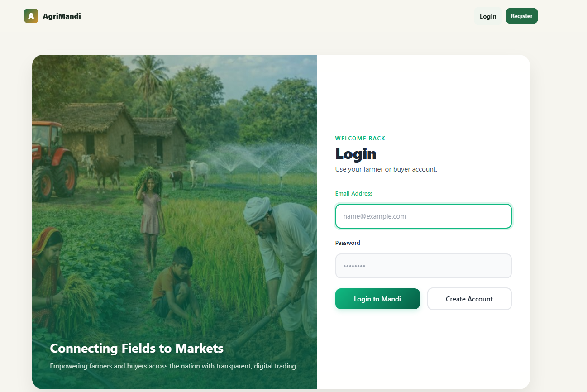
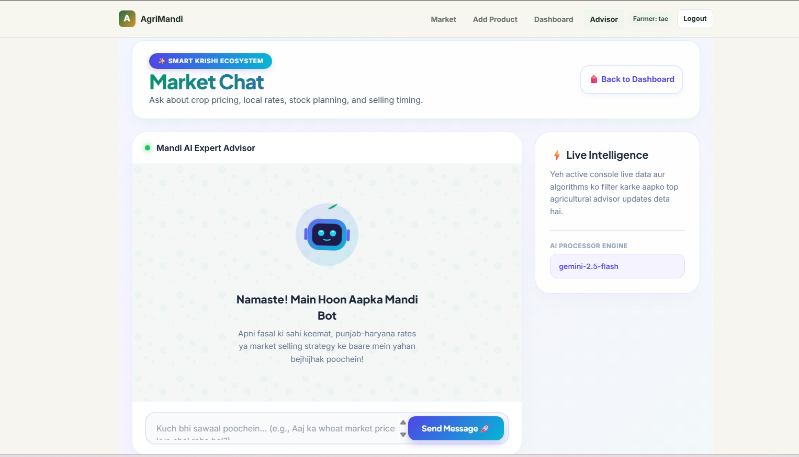
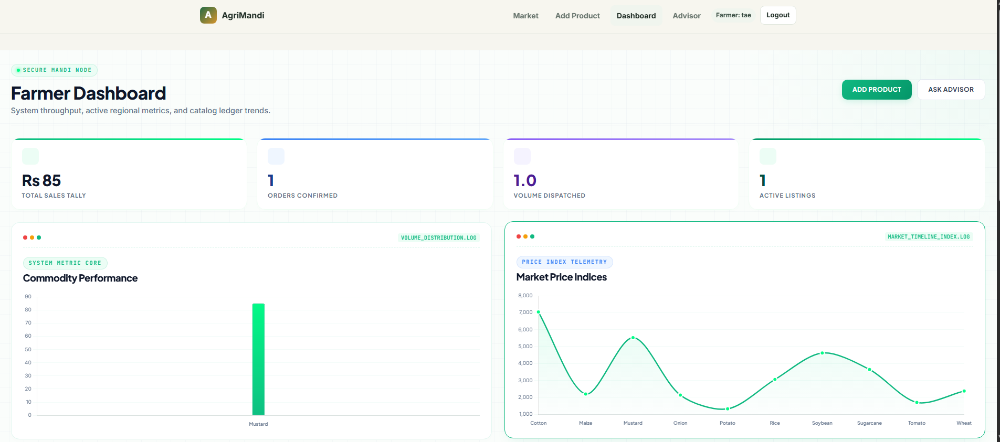
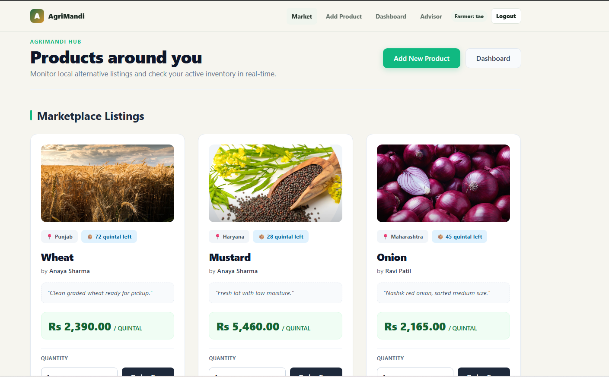

# 🚜 Agri-Connect: Smart Farming Marketplace

Agri-Connect is a modern, full-stack web platform designed to bridge the gap between farmers and the market. By integrating AI-driven insights and real-time price comparison, we empower farmers to make better financial decisions and reach a wider customer base.

---

## 📸 Platform Overview

<!-- Add your screenshots here -->

*Figure: User-friendly dashboard for farmers to manage their produce.*


*Figure: Integrated AI assistant helping farmers with market trends.*

---

## 🚀 Key Features

*   **AI-Integrated Chat:** Get instant answers to your farming queries, market trend analysis, and personalized suggestions through our integrated AI assistant.
*   **Direct-to-Market Selling:** Farmers can list their harvest directly, removing intermediaries and ensuring better profit margins.
*   **Real-time Price Comparison:** Compare market rates across different regions to sell your products at the best possible price.
*   **User-Friendly Interface:** Built with a focus on simplicity, ensuring farmers can navigate the platform with ease.

---

## 🛠 Tech Stack

*   **Frontend:** [Add your framework, e.g., React, Blade, or HTML/CSS]
*   **Backend:** Laravel (PHP)
*   **Database:** [e.g., MySQL/PostgreSQL]
*   **AI Integration:** [e.g., OpenAI API / Custom LLM]
*   **Deployment:** [e.g., AWS / Vercel / DigitalOcean]

---

*Comapre your growth through Graphs and see Market local prices.*

*Buyers orders and farmers get updated *

## 📋 Installation

1. **Clone the repository:**
```bash
   git clone [https://github.com/yourusername/agri-connect.git](https://github.com/yourusername/agri-connect.git)
   cd agri-connect


